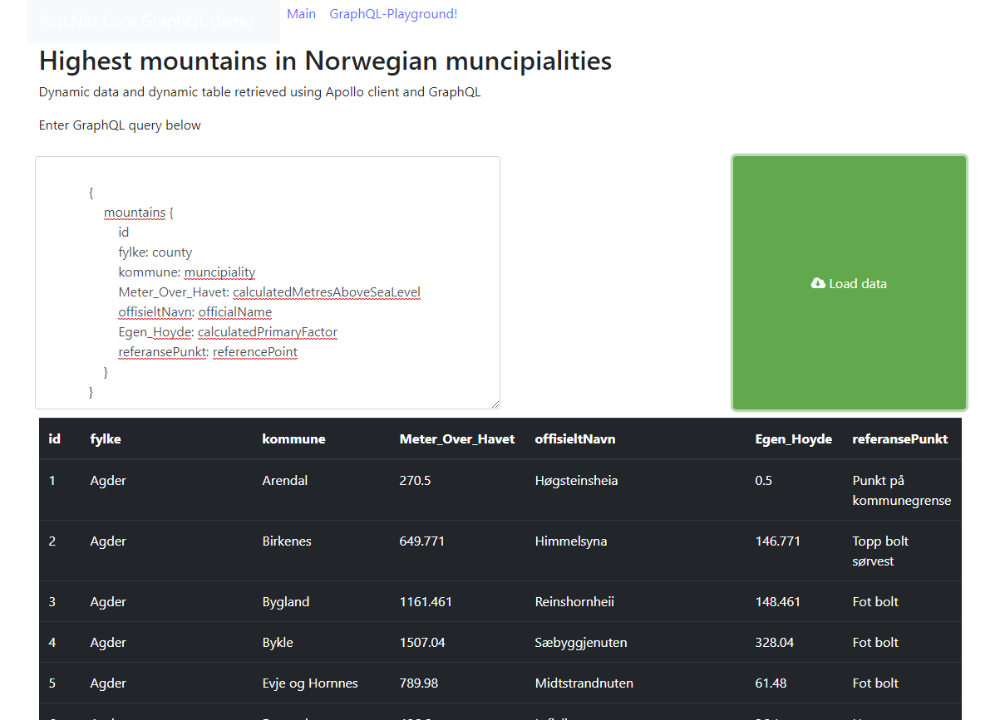

### GraphQL demo - Asp.Net Core 


This solution shows how to get started with GraphQL in an Asp.Net Core solution. 


### Sample GraphQL queries


The following query will retrieve mountain data using GraphQL:


#### Selection / Query

```json

{
  mountains {
    id
    fylke: county
    kommune: muncipiality
    hoydeOverHavet: calculatedMetresAboveSeaLevel
    offisieltNavn: officialName
    primaerfaktor: calculatedPrimaryFactor
    referansePunkt: referencePoint
  }
}


```

It is possible to retrieve this same data via Postman using the following GET call:

```bash
http://localhost:2542/graphql?query={mountains{id fylke: county kommune: calculatedMetresAboveSeaLevel offisieltNavn: officialName primaerfaktor: calculatedPrimaryFactor referansePunkt: referencePoint}}
```


#### Alteration / Mutation 

The following call shows how to add a mountain using GraphQL and the 
createMountain mutation. 


```json 

mutation {
  createMountain(mountain: {
   county: "Svalbard"
  muncipiality: "Svalbard"
  officialName: "Newtontoppen"
  referencePoint: "Isbjønn på toppen"
  comments: "Husk rask snøskuter",
  metresAboveSeaLevel: "1713",
  primaryFactor: "1713"
  }) {    
    id
  }
}
```

And the following mutation shows how we can remove a mountain using GraphQL and the 
removeMountain mutation: 


```json 
mutation {
  removeMountain(id: {
    id: 365
  }) { id }
}
```

### Client library 
The following port of Apollo Client (an industry standard GraphQL client for several platforms, such as node/npm) is made browser ready from this Github repo:
https://github.com/Akryum/apollo-client-browser

It can be included like the following script reference or copied into the wwwroot 
folder locally for an Asp.Net Core application:


```js
<script src="https://unpkg.com/apollo-client-browser@1.7.0"></script>

```


### Demo page showing dynamic table 

With GraphQL we can choose which columns to load into a table
over with customizable data over the network, allowing the client
to specify which data is interesting.




### Subscription

Go to the Playground (open up a tab) and paste in this subscription:

```
subscription {detailsDisplayed {id} }

```

Back in the DEMO, whenever you go into the details page, the subscription will show 
that details is displayed with a given id. This shows that GraphQL supports a Pub Sub pattern 
in case it is desired to support notifications. This is done using Web Sockets. 